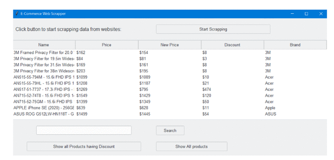

# Web Scrapper
Web scrapping on ecommerce websites 

---

### Table of Contents

- [Description](#description)
- [Technologies](#technologies)
- [Target](#target)

---

## Description

A web scrapper that with the help of BeautifulSoup4 as parser i have achieved to scrape three ecommerce  websites . Also used Tkinter library to make GUI where are stated the articles in rows and their descriptions such as name ,price ,discount and brand in columns. The data is saved in CSV files , thereafter is shown in GUI which make them more accessible in our dashboard .

---

#### Technologies

- Python

---

## Target

The target is to have a rapid search of certain products with discount based on the brand we are interested in .

---

